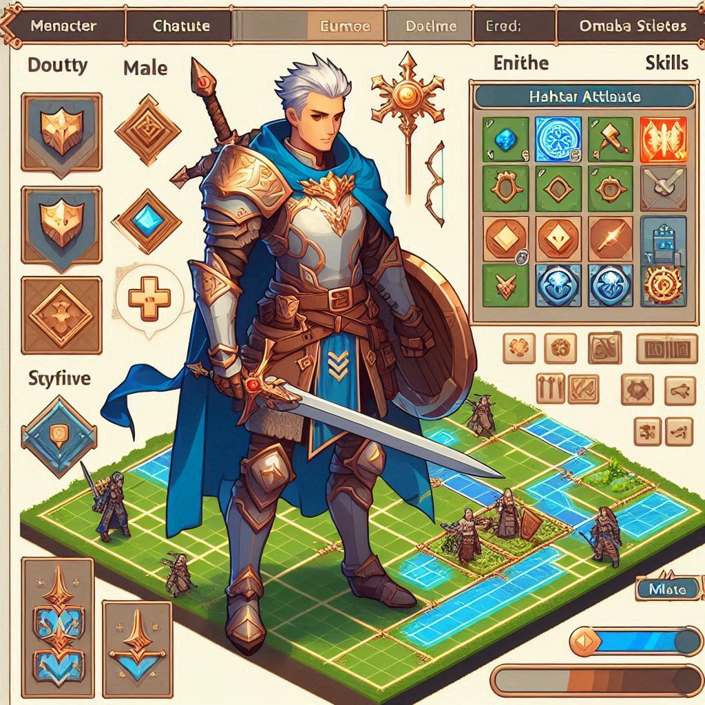

# FlutterTBS
A Flutter-based turn-based strategy game engine featuring a tactical grid system, character attributes, skills, status effects, and an item system. Perfect for building strategic games with a focus on turn-based mechanics.

|  | I am a place occup. I am a place occup. I am a place occup. I am a place occup. I am a place occup. I am a place occup. I am a place occup. |
| - | - |

## 第一階段：基礎框架
1. 六邊形地圖系統
    * 繪製六邊形網格
    * 允許單位放置和移動
    * 計算六邊形距離與範圍
2. 回合制系統
    * 控制玩家輪流行動
    * 管理回合結束與開始的觸發事件
3. 角色管理
    * 角色的基本屬性（血量、攻擊力等）
    * 角色的移動與行動範圍

## 第二階段：進階功能
1. 技能系統
    * 定義角色技能（範圍、傷害、特殊效果）
    * UI 選擇技能並施放
2. 狀態變化系統
    * Buff/Debuff（中毒、加速、護盾等）
    * 狀態影響屬性變化
3.物品系統
    * 物品欄管理
    * 物品使用效果（回血、增強能力等）

## 後續擴展
1. AI 對手支援
2. 多人對戰（本地或聯網）
3. 動畫與特效
